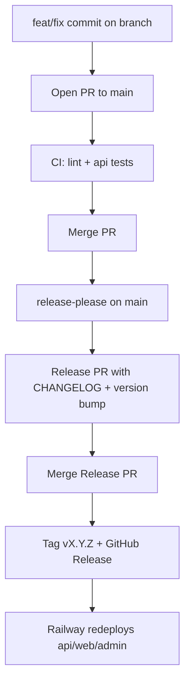

# Releasing — Parfumbox

Parfumbox uses **unified semantic versioning**: one version (`vX.Y.Z`) covers the API, Telegram mini app, and admin panel. [release-please](https://github.com/googleapis/release-please) bumps versions and maintains `CHANGELOG.md` from [Conventional Commits](https://www.conventionalcommits.org/).

## Version sources

| Location | Role |
|----------|------|
| [package.json](../package.json) | Canonical version (release-please updates this) |
| [.release-please-manifest.json](../.release-please-manifest.json) | release-please manifest |
| [apps/api/package.json](../apps/api/package.json) | Mirrored via `extra-files` in release config |
| [apps/web/package.json](../apps/web/package.json) | Mirrored |
| [apps/admin/package.json](../apps/admin/package.json) | Mirrored |

Do not bump versions by hand after this workflow is active. Merge the **Release PR** that release-please opens.

## Commit message format

Enforced locally by **husky** + **commitlint** on every commit.

| Prefix | Semver bump | Example |
|--------|-------------|---------|
| `feat:` | minor | `feat: add order export` |
| `fix:` | patch | `fix: cart quantity overflow` |
| `perf:` | patch | `perf: cache product list` |
| `refactor:` | patch | `refactor: extract order mapper` |
| `docs:` | none (changelog only if configured) | `docs: update Railway guide` |
| `chore:` | none | `chore: bump eslint` |
| `test:` | none | `test: cover checkout flow` |
| `ci:` | none | `ci: add lint job` |

**Breaking change (major bump):** add a footer or `!` in the subject:

```
feat!: remove legacy /v1 endpoints

BREAKING CHANGE: clients must use /v2 routes.
```

## Day-to-day workflow



1. Work on a feature branch; use Conventional Commit messages.
2. Open a PR to `main`. CI runs lint and API tests (see [.github/workflows/api-tests.yml](../.github/workflows/api-tests.yml)).
3. After merge, **release-please** opens or updates a PR titled like `chore: release 1.1.0` with `CHANGELOG.md` and version bumps.
4. Review and merge that Release PR. release-please creates git tag `vX.Y.Z` and a GitHub Release.
5. Railway (or your deploy target) picks up the new tag/commit and redeploys services.

## Runtime version visibility

| Surface | How to read version |
|---------|---------------------|
| API | `GET /version` — `{ version, commit, builtAt }` |
| Admin | Footer in layout: `v1.0.0 · abc1234` |
| Web | Profile page footer |

Docker builds can pass build metadata:

```bash
docker build \
  --build-arg GIT_SHA="$(git rev-parse HEAD)" \
  --build-arg BUILD_TIME="$(date -u +%Y-%m-%dT%H:%M:%SZ)" \
  -f docker/api/Dockerfile .
```

Same `GIT_SHA` / `BUILD_TIME` args apply to [docker/web/Dockerfile](../docker/web/Dockerfile) and [docker/admin/Dockerfile](../docker/admin/Dockerfile) for UI build stamps.

## GitHub setup

- Workflow: [.github/workflows/release-please.yml](../.github/workflows/release-please.yml) runs on every push to `main`.
- Config: [release-please-config.json](../release-please-config.json)
- Ensure the default `GITHUB_TOKEN` has permission to create PRs and releases (workflow sets `contents: write` and `pull-requests: write`).

## Initial baseline

The manifest is pinned at **1.0.0**. The first Release PR after setup may propose **1.0.1** (or higher if `feat:` commits landed since the baseline).

## What not to do

- Do not edit `CHANGELOG.md` manually.
- Do not create `v*` tags manually.
- Do not remove `"version"` from app `package.json` files (release-please syncs them via `extra-files`).
