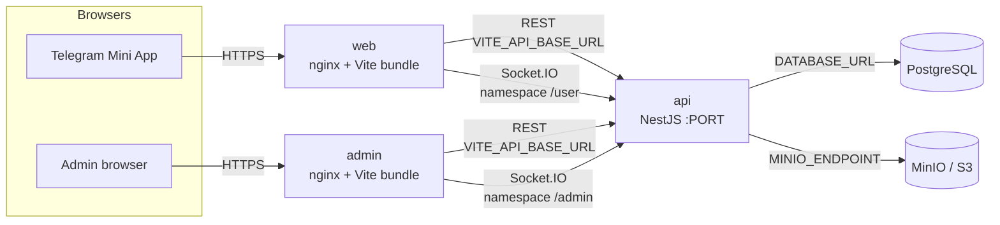

# URL configuration — API ↔ web ↔ admin

This document is the single source of truth for how the three Parfumbox apps address each other. It covers REST + Socket.IO, dev, ngrok, and Railway production.

## Diagram



## Environment variables that drive URLs

### API (`apps/api`)

| Variable | Purpose | Example (Railway) |
|----------|---------|--------------------|
| `PORT` | HTTP listen port. Railway injects this; do not hard-code. | `3000` (provided) |
| `DATABASE_URL` | Postgres connection. Use the Railway reference syntax. | `${{Postgres.DATABASE_URL}}` |
| `CORS_ORIGINS` | Comma-separated browser origins allowed for REST and WebSocket. **MUST** include the public web + admin URLs in production. | `https://web.example.app,https://admin.example.app` |
| `MINIO_ENDPOINT`, `MINIO_PUBLIC_URL` | Storage endpoint reached by the API (`MINIO_ENDPOINT`) and by the browser (`MINIO_PUBLIC_URL`). | See `apps/api/.env.example` |
| `TELEGRAM_WEB_APP_URL` | Public mini app URL used inside Telegram messages. | `https://web.example.app` |

The API reads `CORS_ORIGINS` in two places:

- HTTP CORS in [`apps/api/src/main.ts`](../apps/api/src/main.ts).
- WebSocket gateways: [`admin-orders.gateway.ts`](../apps/api/src/realtime/admin-orders.gateway.ts) and [`user-orders.gateway.ts`](../apps/api/src/realtime/user-orders.gateway.ts).

If `CORS_ORIGINS` is unset in production, the API logs a warning and reflects the request origin (open CORS). Set it explicitly to lock things down.

### Web (`apps/web`)

| Variable | Purpose | Example |
|----------|---------|---------|
| `VITE_API_BASE_URL` | Absolute API URL baked into the bundle at build time. Cross-origin Railway deploys MUST set this. | `https://api.example.app` |

Resolution order in [`apps/web/src/app/parfumApi.ts`](../apps/web/src/app/parfumApi.ts) `getParfumApiBaseUrl()`:

1. `VITE_API_BASE_URL` (trailing slash stripped)
2. Dev mode → `/_parfumbox-api` (Vite proxy in [`apps/web/vite.config.ts`](../apps/web/vite.config.ts) targets `http://127.0.0.1:3000`, `ws: true`)
3. Prod with no env → same-origin (empty string) + console warning

### Admin (`apps/admin`)

Same `VITE_API_BASE_URL` contract as web (see [`apps/admin/src/app/apiBase.ts`](../apps/admin/src/app/apiBase.ts)).

Admin additionally connects to Socket.IO at `/admin` namespace; see [`useAdminOrdersRealtime.ts`](../apps/admin/src/features/orders/useAdminOrdersRealtime.ts):

| API base | Socket.IO URL passed to `io()` | Path option |
|----------|--------------------------------|-------------|
| `/_parfumbox-api` (dev proxy) | `/admin` | `/_parfumbox-api/socket.io` |
| `https://api.example.app` (prod) | `https://api.example.app/admin` | `/socket.io` |
| `''` (prod, env missing) | `/admin` | `/socket.io` |

The Vite proxy must forward WebSocket upgrades (`ws: true` on the `/_parfumbox-api` rule in both `apps/web/vite.config.ts` and `apps/admin/vite.config.ts`).

## Deployment scenarios

### Local development

```
web   → http://localhost:5173 → Vite proxy → http://127.0.0.1:3000
admin → http://localhost:5174 → Vite proxy → http://127.0.0.1:3000
api   → http://localhost:3000
```

Run `pnpm dev:api`, `pnpm dev:web`, `pnpm dev:admin`. No `VITE_API_BASE_URL` needed.

### HTTPS tunnel (ngrok) for Telegram testing

Open Vite over HTTPS via `pnpm dev:web:tunnel`. Keep `VITE_API_BASE_URL` unset so the bundle calls `/_parfumbox-api`, which the Vite proxy forwards to the local Nest API. One tunnel is enough; Socket.IO works over the same origin (`ws: true`).

### Railway (cross-origin)

Each app has its own public origin. Set:

| Service | Variables |
|---------|-----------|
| api | `CORS_ORIGINS=https://<web>,https://<admin>`, `DATABASE_URL=${{Postgres.DATABASE_URL}}`, `TELEGRAM_WEB_APP_URL=https://<web>` |
| web | Build ARG: `VITE_API_BASE_URL=https://<api>` |
| admin | Build ARG: `VITE_API_BASE_URL=https://<api>` |

Step-by-step setup: [`railway/README.md`](../railway/README.md).

Important: web and admin bake `VITE_API_BASE_URL` into static assets at **build time** (Docker `ARG`). After changing the API domain, redeploy web and admin so the new URL ends up in the bundle.

### Same-origin reverse proxy (optional)

If you front the API and one frontend with a single nginx/cloudflare worker (so `/api/*` hits the API and everything else serves the SPA), skip `VITE_API_BASE_URL` entirely. The apps will fall through to same-origin (`''`) requests. CORS becomes a non-issue but you need a custom nginx config (not provided by default in `docker/nginx-spa.conf`).

## Telegram-specific URLs

| Source of truth | Where |
|-----------------|-------|
| Web public URL | Set in BotFather → Menu Button / Web App + `TELEGRAM_WEB_APP_URL` on api |
| Bot username | `TELEGRAM_BOT_USERNAME` on api + `VITE_TELEGRAM_BOT_USERNAME` on web (referral share) |
| Web App short name | `TELEGRAM_WEB_APP_SHORT_NAME` on api + `VITE_TELEGRAM_WEB_APP_SHORT_NAME` on web |
| Bot token | `TELEGRAM_BOT_TOKEN` on api **only** — never a `VITE_*` variable |

## Smoke tests after deploy

1. `curl https://<api>/health` → `{"status":"ok","info":{"database":{"status":"up"}}}`
2. Open `https://<web>` and `https://<admin>` in a browser, watch the network tab:
   - Requests must go to `https://<api>` (not `localhost:3000` or `/_parfumbox-api`).
   - No CORS preflight failures.
3. Sign into admin → `Network` → `WS` filter should show a successful `socket.io/?EIO=4&...` upgrade to `wss://<api>/admin`.
4. From Telegram, open the mini app via BotFather menu button — requests should target `https://<api>`.

## Troubleshooting URL issues

| Symptom | Cause | Fix |
|---------|-------|-----|
| Frontend calls `localhost:3000` in production | `VITE_API_BASE_URL` wasn't set before the Docker build | Set the variable, rebuild the service |
| CORS preflight 4xx in browser | API `CORS_ORIGINS` doesn't include the exact frontend origin (scheme + host + port) | Add the public origin(s); restart api |
| Socket.IO 404 / disconnects in admin | Wrong namespace or missing `ws: true` proxy in dev | Use `/admin` namespace + `/socket.io` path; ensure Vite proxy has `ws: true` |
| Mixed-content (https → http) in browser | Admin opened via HTTPS but `VITE_API_BASE_URL` is HTTP | Always use HTTPS API URL in production |
| Telegram cannot load the mini app | Wrong URL in BotFather, or web origin differs from `TELEGRAM_WEB_APP_URL` | Align BotFather URL + `TELEGRAM_WEB_APP_URL` to the same public HTTPS origin |
