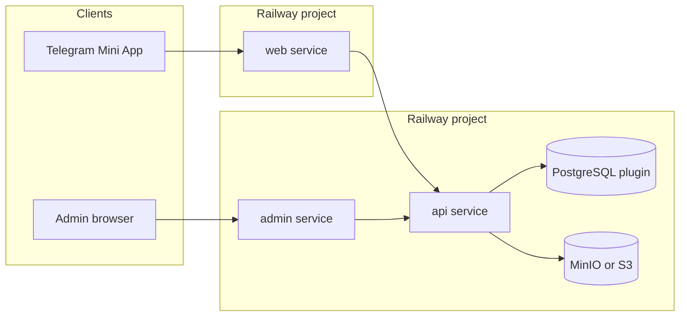

# Railway deployment

Parfumbox runs on [Railway](https://railway.com) as **separate services** (not the root `docker-compose.yml`). Railway detects Dockerfiles under `docker/` but does not provision Postgres or MinIO from compose automatically.

## Architecture



## One-time setup

### 1. Create project and Postgres

1. [New project](https://railway.com/new) → deploy from this GitHub repo.
2. **+ New** → **Database** → **PostgreSQL**.
3. Note the Postgres service name (e.g. `Postgres`) for variable references.

### 2. Create three application services

Create **three empty services** from the same repo (or rename services Railway auto-created from Dockerfiles):

| Service | Config file variable | Dockerfile (also in config file) |
|---------|----------------------|----------------------------------|
| `api` | `RAILWAY_CONFIG_FILE=railway/api.json` | `docker/api/Dockerfile` |
| `web` | `RAILWAY_CONFIG_FILE=railway/web.json` | `docker/web/Dockerfile` |
| `admin` | `RAILWAY_CONFIG_FILE=railway/admin.json` | `docker/admin/Dockerfile` |

For each service → **Settings**:

- **Root directory**: `/` (repository root; required for monorepo Docker builds).
- Do **not** set a nested root like `apps/api` — Dockerfiles copy from repo root.

Set the **Variables** on each service:

| Service | Variable | Value |
|---------|----------|--------|
| api | `RAILWAY_CONFIG_FILE` | `railway/api.json` |
| web | `RAILWAY_CONFIG_FILE` | `railway/web.json` |
| admin | `RAILWAY_CONFIG_FILE` | `railway/admin.json` |

Config-as-code in `railway/*.json` sets the Dockerfile path, watch patterns, and health checks. It overrides dashboard build settings per deployment.

### 3. API variables

On the **api** service, add variables from [`env.api.example`](env.api.example). Minimum:

```text
DATABASE_URL=${{Postgres.DATABASE_URL}}
```

Replace `Postgres` with your database service name. Add JWT secrets, `TELEGRAM_BOT_TOKEN`, `CORS_ORIGINS`, and MinIO/S3 settings.

The API container runs `prisma migrate deploy` on start (see `docker/api/docker-entrypoint.sh`).

### 4. Web and admin build variables

Set **before** the first successful build (Docker `ARG`):

| Service | Variable | Example |
|---------|----------|---------|
| web | `VITE_API_BASE_URL` | `https://api-production-xxxx.up.railway.app` |
| admin | `VITE_API_BASE_URL` | same public API URL |

Templates: [`env.web.example`](env.web.example), [`env.admin.example`](env.admin.example).

Redeploy web/admin after changing `VITE_API_BASE_URL` (value is baked into static assets).

### 5. Public domains

Generate Railway domains (or custom domains) for api, web, and admin. Update:

- `CORS_ORIGINS` on api
- `VITE_API_BASE_URL` on web and admin
- `TELEGRAM_WEB_APP_URL` and BotFather Web App URL → web origin

### 6. Object storage

Compose bundles MinIO locally; Railway does not. Options:

- Deploy a [MinIO template](https://railway.com/template) or bucket plugin in the same project.
- Use external S3-compatible storage and map `MINIO_*` env vars on api (see `apps/api/.env.example`).

## Optional: import from Compose

To stage all three app builds at once, drag [`docker-compose.railway.yml`](docker-compose.railway.yml) onto the project canvas. You still must add PostgreSQL and wire `DATABASE_URL` on api. Remove duplicate services if Railway already created api/web/admin.

## Local vs Railway

| Concern | Local `docker-compose.yml` | Railway |
|---------|---------------------------|---------|
| Database host | `db` | `${{Postgres.DATABASE_URL}}` |
| API URL in frontends | `http://localhost:3000` | Public api HTTPS URL |
| MinIO | compose `minio` service | Separate service or external S3 |
| Migrations | entrypoint on api start | same entrypoint |

## Troubleshooting

| Symptom | Fix |
|---------|-----|
| API crash on deploy | Ensure Postgres exists and `DATABASE_URL` references it; check deploy logs for Prisma errors |
| Browser calls `localhost:3000` | Set `VITE_API_BASE_URL` on web/admin and redeploy |
| CORS errors | Set `CORS_ORIGINS` on api to exact web/admin HTTPS origins |
| Upload/presign fails | Configure `MINIO_*` for production storage |

See also [docs/DEVOPS.md](../docs/DEVOPS.md#railway) and [docs/URL_CONFIGURATION.md](../docs/URL_CONFIGURATION.md) for the full URL contract (REST + Socket.IO + Telegram).
